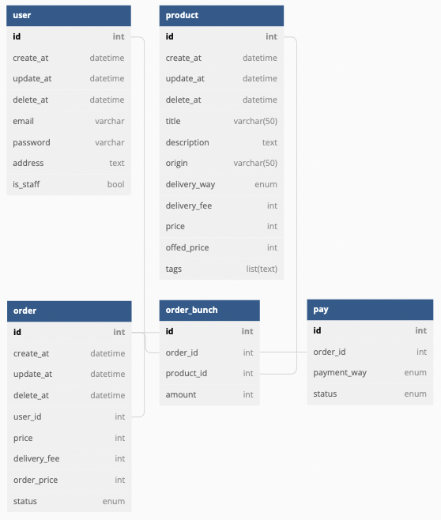

# user-role-Ecommerce

RoleGuard가 적용된 쇼핑몰 서비스 API

## 목차 🙇‍♂️

- [Skills](#👨‍🔧-skills)
- [서비스개요](#📑-서비스-개요)
- [구현사항](#🛠-구현-사항)
- [ERD](#🚧-erd)
- [프로젝트 실행](#🚀-프로젝트-실행)
- [문서](#📚-문서)

## 👨‍🔧 Skills

### API

<div>
   
   
  
  
  
</div>

### ORM


### DB


### Docs


## 📑 서비스 개요

- 회원가입을 통해 로그인, 회원정보를 조회할 수 있습니다.
- 일반 사용자는 상품을 조회하고, 주문할 수 있습니다.
- 관리자는 상품 등록 & 수정이 가능하고, 주문을 관리 할 수 있습니다.

## 🛠 구현 사항

### 1. JWT를 이용한 AuthGuard 적용

### 2. RoleGuard를 이용해 일반사용자, 관리자 권한 처리

### 3. 상품 CRUD

- 일반 사용자: RR
- 관리자: CRRUD

### 4. 주문 CRUD

- 일반 사용자: CRRUD
  - Update: 주문 취소만 사용할 수 있음.
  - Delete: 주문이 종료 또는 취소된 경우에만 삭제 가능
- 관리자: CRRUD

### 5. Validation

- Create, Update 요청의 Validation 적용

## 🚧 ERD



## 🚀 프로젝트 실행

### 1. .env 작성

```text
MODE="dev" # dev, prod
PORT=3000

JWT_SECRET_KEY=
JWT_EXPIRESIN=
```

### 2. 프로젝트 실행

```bash
$ npm install

$ npm run seed:run # 기본 데이터 삽입

$ npm run start:dev
```

## 📚 문서

### [Local Swagger API](http://localhost:3000/docs)
